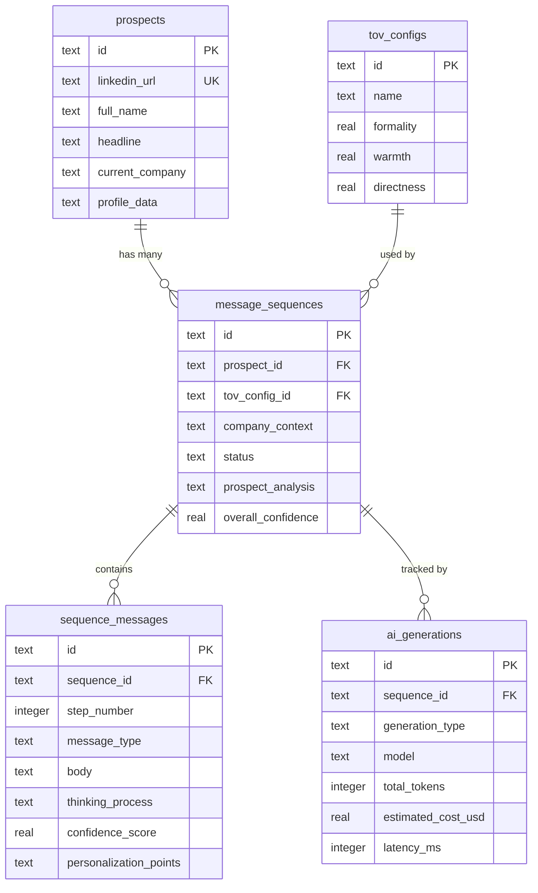
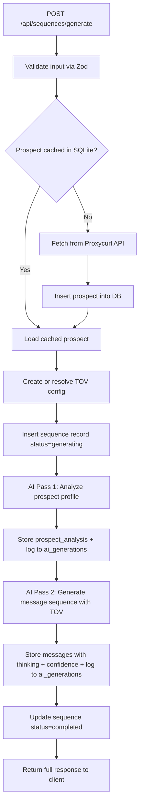

# LinkedIn Prospect Messaging Sequence Generator

## Stack

- **Backend**: Express.js + TypeScript
- **Frontend**: React + Vite + TypeScript
- **Database**: SQLite (via `better-sqlite3`)
- **ORM**: Drizzle ORM (supports SQLite natively, type-safe)
- **AI**: OpenAI API (`gpt-4o-mini` primary, `gpt-4o` fallback)
- **LinkedIn Data**: Proxycurl API
- **Validation**: Zod (shared schema validation)
- **Styling**: Tailwind CSS + shadcn/ui (fast, polished UI)

## Monorepo Structure

```
/
├── backend/
│   ├── package.json
│   ├── tsconfig.json
│   ├── drizzle.config.ts
│   ├── data/                    # SQLite DB file lives here
│   │   └── .gitkeep
│   └── src/
│       ├── index.ts             # Express app entry
│       ├── config/
│       │   └── env.ts           # Typed env vars via Zod
│       ├── db/
│       │   ├── schema.ts        # All Drizzle table definitions
│       │   ├── migrate.ts       # Migration runner
│       │   └── index.ts         # DB connection
│       ├── routes/
│       │   ├── sequences.ts     # /api/sequences endpoints
│       │   ├── tov-configs.ts   # /api/tov-configs CRUD
│       │   ├── prospects.ts     # /api/prospects
│       │   └── health.ts        # /api/health
│       ├── services/
│       │   ├── linkedin.service.ts
│       │   ├── ai.service.ts
│       │   ├── sequence-generator.ts
│       │   └── tov-translator.ts
│       ├── middleware/
│       │   ├── error-handler.ts
│       │   └── validate.ts
│       └── types/
│           └── index.ts
├── frontend/
│   ├── package.json
│   ├── tsconfig.json
│   ├── vite.config.ts
│   ├── tailwind.config.ts
│   ├── index.html
│   └── src/
│       ├── main.tsx
│       ├── App.tsx
│       ├── api/
│       │   └── client.ts        # Typed fetch wrapper
│       ├── components/
│       │   ├── ui/              # shadcn components
│       │   ├── GenerateForm.tsx  # Main generation form
│       │   ├── SequenceView.tsx  # Display messages + thinking
│       │   ├── TovConfigurator.tsx # TOV sliders + presets
│       │   ├── SequenceList.tsx  # History of past sequences
│       │   ├── ProspectCard.tsx  # Prospect profile display
│       │   └── ThinkingProcess.tsx # AI reasoning visualization
│       ├── pages/
│       │   ├── HomePage.tsx
│       │   ├── SequenceDetailPage.tsx
│       │   ├── TovConfigsPage.tsx
│       │   └── HistoryPage.tsx
│       ├── hooks/
│       │   └── useApi.ts        # Data fetching hooks
│       └── types/
│           └── index.ts         # Shared types (mirrored from backend)
└── README.md
```

## Database Schema (5 tables, SQLite)

SQLite does not have a native JSONB type. We use TEXT columns for JSON data and serialize/deserialize in the application layer. Drizzle's `text("col", { mode: "json" })` handles this transparently.

### `prospects`

- `id` TEXT PK (nanoid or UUID string)
- `linkedin_url` TEXT UNIQUE -- normalized URL
- `linkedin_username` TEXT
- `full_name` TEXT
- `headline` TEXT
- `summary` TEXT
- `current_company` TEXT
- `current_position` TEXT
- `location` TEXT
- `industry` TEXT
- `profile_data` TEXT (JSON) -- full raw Proxycurl response
- `created_at` TEXT (ISO 8601)
- `updated_at` TEXT (ISO 8601)

### `tov_configs`

- `id` TEXT PK
- `name` TEXT -- label like "Formal Sales"
- `formality` REAL -- 0.0 to 1.0
- `warmth` REAL
- `directness` REAL
- `humor` REAL (optional)
- `enthusiasm` REAL (optional)
- `custom_instructions` TEXT
- `created_at` TEXT
- `updated_at` TEXT

### `message_sequences`

- `id` TEXT PK
- `prospect_id` TEXT FK -> prospects
- `tov_config_id` TEXT FK -> tov_configs
- `company_context` TEXT
- `sequence_length` INTEGER
- `status` TEXT -- `pending` | `generating` | `completed` | `failed`
- `prospect_analysis` TEXT (JSON) -- AI's structured analysis
- `overall_confidence` REAL
- `error_message` TEXT
- `created_at` TEXT
- `updated_at` TEXT

### `sequence_messages`

- `id` TEXT PK
- `sequence_id` TEXT FK -> message_sequences
- `step_number` INTEGER
- `message_type` TEXT -- `connection_request`, `follow_up`, `value_add`, `breakup`
- `subject` TEXT (nullable)
- `body` TEXT
- `thinking_process` TEXT -- AI's reasoning
- `confidence_score` REAL
- `personalization_points` TEXT (JSON)
- `created_at` TEXT

### `ai_generations`

- `id` TEXT PK
- `sequence_id` TEXT FK -> message_sequences
- `generation_type` TEXT -- `prospect_analysis` | `sequence_generation`
- `model` TEXT
- `prompt_tokens` INTEGER
- `completion_tokens` INTEGER
- `total_tokens` INTEGER
- `estimated_cost_usd` REAL
- `latency_ms` INTEGER
- `raw_prompt` TEXT
- `raw_response` TEXT (JSON)
- `status` TEXT -- `success` | `error` | `timeout`
- `error_message` TEXT
- `created_at` TEXT

### ER Diagram




## Data Flow




## AI Integration: Two-Pass Approach

**Pass 1 -- Prospect Analysis**: Sends prospect profile to OpenAI, asks for structured JSON output containing professional summary, pain points, personalization hooks, and recommended messaging angles.

**Pass 2 -- Sequence Generation**: Combines Pass 1 analysis + TOV translation + company context into a prompt that generates the full message sequence. Each message includes body, thinking process, confidence score, and personalization points used.

Both passes use OpenAI's `response_format: { type: "json_object" }` for reliable structured output. Token counts and costs are tracked per call in `ai_generations`.

## TOV Translation

`tov-translator.ts` maps numeric parameters (0-1) to calibrated natural language:

- 0.0-0.3 = low intensity descriptor
- 0.3-0.7 = moderate descriptor
- 0.7-1.0 = high intensity descriptor

Example: `formality: 0.8` becomes "Use professional, formal language. Avoid slang and contractions. Address the prospect respectfully."

All axes combine into a tone paragraph injected into the system prompt.

## Frontend Pages

1. **Home / Generate** -- Form with LinkedIn URL input, company context textarea, TOV sliders (formality/warmth/directness with real-time labels), sequence length selector, and a "Generate" button. Shows loading state during generation.
2. **Sequence Detail** -- Displays prospect profile card, the generated messages in a step-by-step timeline, expandable "AI Thinking" panels per message, confidence score badges, and overall analysis.
3. **TOV Configs** -- List saved TOV presets, create new ones with sliders, preview tone description in real-time.
4. **History** -- Paginated list of past sequence generations with status, prospect name, date, and quick navigation to detail view.

## API Endpoints

### Sequences

- `POST /api/sequences/generate` -- Main generation endpoint
- `GET /api/sequences` -- List all sequences (with pagination)
- `GET /api/sequences/:id` -- Full sequence detail with messages + AI metadata

### TOV Configs

- `POST /api/tov-configs` -- Create a reusable TOV config
- `GET /api/tov-configs` -- List all configs
- `GET /api/tov-configs/:id` -- Get specific config
- `PUT /api/tov-configs/:id` -- Update a config
- `DELETE /api/tov-configs/:id` -- Delete a config

### Other

- `GET /api/prospects/:id` -- Get prospect profile
- `GET /api/health` -- Health check

## Error Handling

- **Proxycurl errors**: 502 with descriptive message; prospect data cached to avoid repeated failures
- **OpenAI errors**: Retry 3x with exponential backoff; fallback from `gpt-4o-mini` to `gpt-4o`; every attempt logged in `ai_generations`
- **Validation errors**: 400 with Zod error details
- **Global**: Express error middleware catches unhandled errors, returns consistent JSON error format

## Deployment

- **Backend**: Railway / Render -- Express serves API, SQLite file persists on disk (or use Turso/LibSQL for cloud SQLite)
- **Frontend**: Vercel or serve as static from Express in production
- Vite proxy config during development: `/api` -> `http://localhost:3001`

